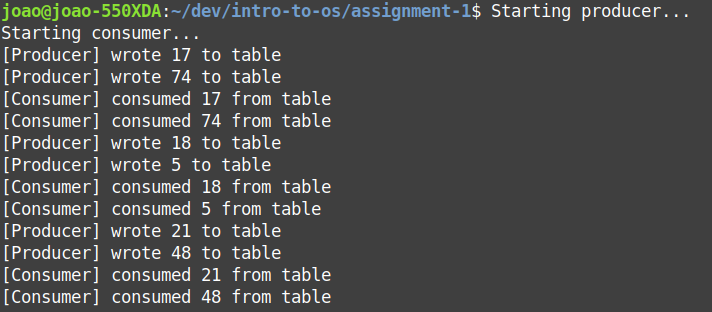

# Programming Assignment 1

## Implementation details
- Note that `empty_sem` is initialized to 1 and `full_sem` is initialized to 0
    - We need this in order to ensure that initially the consumer will wait and the producer will produce
- Code for creating/accessing semaphores and shared memory space is pretty much the same for `producer.c` and `consumer.c`.
- There is 1 second `sleep` call when producing/consuming just to simulate work

## Compiling and running
- There is a `LOOP` macro on both .c files
    - By default it is set to 3 and controls how many iterations of produce until full, then consume until empty the program will do.
- Compile producer: `gcc producer.c -pthread -lrt -o producer`
- Compile consumer: `gcc consumer.c -pthread -lrt -o consumer`
- Run with `sudo ./producer & sudo ./consumer &`

## Examples

- The two processes are initialized
- Initially consumer will wait until producer signals that the buffer is full
- Producer enters the critical section and generates 2 random numbers to add to table
- After consumer is signaled, it consumes (just reading and printing) the numbers from the table. And signals producer that the table is empty
- Repeat

## Important Note
- Apparently if we don't let the cleanup part at the end of producer run, it will not work properly if we try running it again.
    - This will happen if we exit out of producer before it finishes the while loop and runs the cleanup
    - (Shared memory and semaphores persist after program ends)
- For this scenario, there is a commented piece of code at the start of `producer.c` under the "emergency cleanup" comment
    - Uncomment this to make sure the semaphores are cleared and initialized properly if you end up running the processes and not letting the cleanup finish