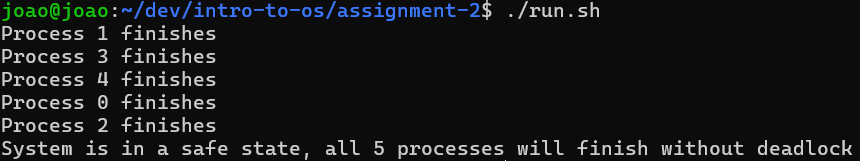
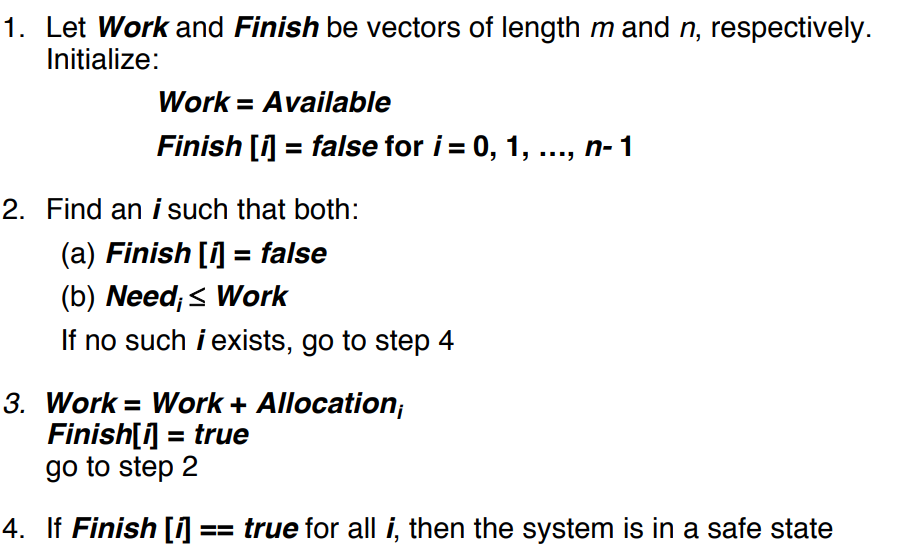

# Programming Assignment 2

## Examples
- This is what the program will print out after running with the data from the assignment

## Data format
- Data is stored in data.txt
- Each row is a set of resources, each column is a resource
- Number of resources and processes must be specified in the following macros in `banker.cpp`
    - `NUM_PROCESSES` and `NUM_RESOURCES`
- Based on this, program will read the required matrices and compute the need matrix

## Algorithm
- I used the safety algorithm pseudocode from the slides
- The implementation is found after line 57
    - My implementation prints out the safe order of processes as it finds it

## How to Use/Compile/Run
- Data from the assignment requirements is already in `data.txt` and the appropriate variables for parsing it are are set (`NUM_PROCESSES` and `NUM_RESOURCES`)
- I have included a sh script `run.sh` that simply compiles the program and executes it
- Additionally, there is a `debugMatrix` function that can be called to print the input read from `data.txt` if needed for debugging